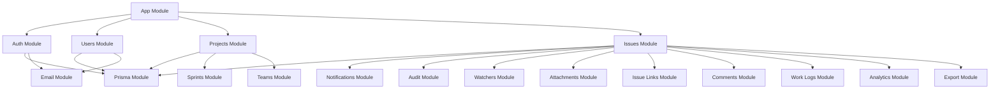
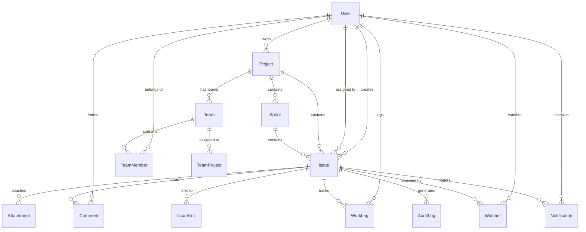
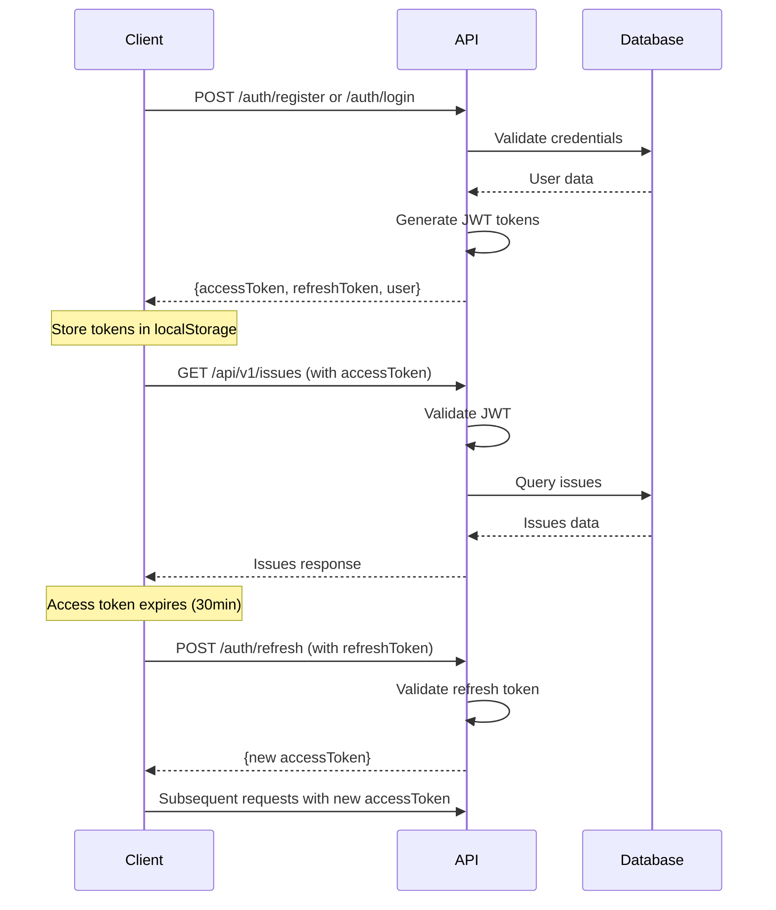
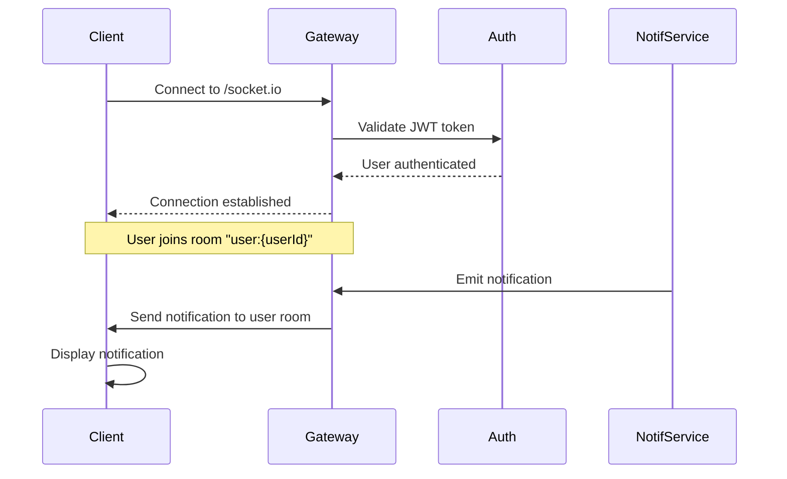

# GodJira Architecture Documentation

This document describes the current system architecture of GodJira, including backend structure, data models, API design, and deployment architecture.

## Table of Contents

1. [System Overview](#system-overview)
2. [Backend Architecture](#backend-architecture)
3. [Database Schema](#database-schema)
4. [API Architecture](#api-architecture)
5. [Authentication & Authorization](#authentication--authorization)
6. [Real-Time Communication](#real-time-communication)
7. [File Storage](#file-storage)
8. [Monitoring & Observability](#monitoring--observability)
9. [Deployment Architecture](#deployment-architecture)

---

## System Overview

GodJira is an enterprise-grade project management system (JIRA clone) built with a modern, scalable architecture.

### High-Level Architecture

```
┌─────────────┐         ┌─────────────┐         ┌─────────────┐
│   Frontend  │◄───────►│   Backend   │◄───────►│  PostgreSQL │
│  React SPA  │  REST   │   NestJS    │   ORM   │  Database   │
│             │  WS     │             │         │             │
└─────────────┘         └─────────────┘         └─────────────┘
       │                       │                       │
       │                       │                       │
       ▼                       ▼                       ▼
┌─────────────┐         ┌─────────────┐         ┌─────────────┐
│   Browser   │         │  Prometheus │         │   pgAdmin   │
│   Storage   │         │  + Grafana  │         │   (Admin)   │
└─────────────┘         └─────────────┘         └─────────────┘
```

### Technology Stack

**Backend:**
- **Framework:** NestJS 10.4 (Node.js 20+)
- **ORM:** Prisma 6.18
- **Database:** PostgreSQL 15
- **Authentication:** JWT with Passport.js
- **Real-time:** Socket.io 4.8
- **API Documentation:** Swagger/OpenAPI
- **Email:** Nodemailer
- **File Processing:** Multer + Sharp
- **Data Export:** ExcelJS + CSV-Writer
- **Monitoring:** Prometheus Client

**Infrastructure:**
- **Containerization:** Docker (multi-stage builds)
- **Orchestration:** Kubernetes + Helm 3
- **Package Manager:** pnpm (monorepo with Turborepo)
- **Build System:** TypeScript 5.x + NestJS CLI

---

## Backend Architecture

### Modular Architecture

GodJira backend follows NestJS modular architecture with **16 independent modules**:

```
apps/src/
├── auth/              # Authentication & JWT strategies
├── users/             # User management & RBAC
├── projects/          # Project CRUD & statistics
├── sprints/           # Sprint lifecycle management
├── issues/            # Issue tracking & workflows
├── comments/          # Comments with @mentions
├── worklogs/          # Time tracking
├── issue-links/       # Issue relationships
├── watchers/          # Issue subscriptions
├── teams/             # Team management
├── audit/             # Audit logs & activity feeds
├── notifications/     # Real-time WebSocket notifications
├── analytics/         # Reports, charts, burndown
├── attachments/       # File uploads with thumbnails
├── export/            # CSV/Excel export
├── email/             # Email notifications
├── health/            # Health checks
├── metrics/           # Prometheus metrics
├── prisma/            # Database connection
└── common/            # Shared utilities & guards
```

### Module Dependency Graph



### Request Lifecycle

```
1. Client Request
   │
   ▼
2. Global Middleware (helmet, CORS, compression)
   │
   ▼
3. Rate Limiting (100 req/min per IP)
   │
   ▼
4. Authentication Guard (JWT validation)
   │
   ▼
5. Authorization Guard (RBAC check)
   │
   ▼
6. Validation Pipe (DTO validation)
   │
   ▼
7. Controller Handler
   │
   ▼
8. Service Layer (business logic)
   │
   ▼
9. Prisma ORM (database query)
   │
   ▼
10. Response Transformation
   │
   ▼
11. Audit Logging (if applicable)
   │
   ▼
12. Real-time Notifications (if applicable)
   │
   ▼
13. Client Response
```

---

## Database Schema

### Entity Relationship Overview

GodJira uses **16 database models** with comprehensive relationships:



### Core Models

#### 1. User Model
```typescript
User {
  id: UUID (PK)
  email: string (unique)
  password: string (bcrypt, 12 rounds)
  name: string
  bio?: string
  jobTitle?: string
  department?: string
  role: UserRole (ADMIN | MANAGER | USER)
  avatar?: string (base64)
  isActive: boolean
  isEmailVerified: boolean
  passwordHistory: string[] (NIST compliance)
  failedLoginAttempts: number
  lockedUntil?: DateTime
  createdAt: DateTime
  updatedAt: DateTime
}
```

#### 2. Project Model
```typescript
Project {
  id: UUID (PK)
  key: string (unique, e.g., "WEB", "API")
  name: string
  description?: string
  ownerId: UUID (FK → User)
  createdAt: DateTime
  updatedAt: DateTime
}
```

#### 3. Issue Model
```typescript
Issue {
  id: UUID (PK)
  key: string (unique, e.g., "WEB-123")
  title: string
  description?: string
  type: IssueType (TASK|BUG|STORY|EPIC|SPIKE)
  status: IssueStatus (BACKLOG|TODO|IN_PROGRESS|...)
  priority: IssuePriority (LOW|MEDIUM|HIGH|URGENT|CRITICAL)
  estimate?: number (story points)
  projectId: UUID (FK → Project)
  sprintId?: UUID (FK → Sprint)
  creatorId: UUID (FK → User)
  assigneeId?: UUID (FK → User)
  parentId?: UUID (FK → Issue, self-reference)
  createdAt: DateTime
  updatedAt: DateTime
}
```

#### 4. Sprint Model
```typescript
Sprint {
  id: UUID (PK)
  name: string
  goal?: string
  startDate?: DateTime
  endDate?: DateTime
  status: SprintStatus (PLANNED|ACTIVE|COMPLETED|CANCELLED)
  projectId: UUID (FK → Project)
  createdAt: DateTime
  updatedAt: DateTime
}
```

### Enumerations

**UserRole:**
- `ADMIN` - Full system access
- `MANAGER` - Project management access
- `USER` - Standard user access

**IssueType:**
- `TASK` - Regular task
- `BUG` - Bug/defect
- `STORY` - User story
- `EPIC` - Large feature spanning multiple sprints
- `SPIKE` - Research/investigation task

**IssueStatus:**
- `BACKLOG` - Not yet planned
- `TODO` - Planned but not started
- `IN_PROGRESS` - Currently being worked on
- `IN_REVIEW` - Under review/testing
- `BLOCKED` - Blocked by dependencies
- `DONE` - Completed
- `CLOSED` - Archived/closed

**IssuePriority:**
- `LOW` - Low priority
- `MEDIUM` - Normal priority
- `HIGH` - High priority
- `URGENT` - Requires immediate attention
- `CRITICAL` - System-critical issue

**NotificationType:**
- `ISSUE_ASSIGNED` - Issue assigned to user
- `ISSUE_UPDATED` - Issue details changed
- `ISSUE_COMMENTED` - New comment added
- `ISSUE_MENTIONED` - User mentioned in comment
- `ISSUE_STATUS_CHANGED` - Status transition
- `SPRINT_STARTED` - Sprint activated
- `SPRINT_COMPLETED` - Sprint finished
- `TEAM_ADDED` - User added to team
- `WATCHER_ADDED` - User added as watcher

---

## API Architecture

### RESTful API Design

**Base URL:** `http://localhost:3000/api/v1`

**API Documentation:** `http://localhost:3000/api/docs` (Swagger UI)

### Endpoint Structure

```
/api/v1/
├── auth/                    # Authentication (10 endpoints)
│   ├── POST   /register         # Register new user
│   ├── POST   /login            # Login with credentials
│   ├── POST   /logout           # Invalidate tokens
│   ├── POST   /refresh          # Refresh access token
│   ├── GET    /profile          # Get current user
│   ├── POST   /forgot-password  # Request password reset
│   ├── POST   /reset-password   # Reset password with token
│   ├── POST   /verify-email     # Verify email with token
│   ├── POST   /resend-verification  # Resend verification email
│   └── PATCH  /change-password  # Change password (authenticated)
│
├── users/                   # User Management (12 endpoints)
│   ├── GET    /              # List all users (paginated)
│   ├── POST   /              # Create user (admin only)
│   ├── GET    /me            # Get current user profile
│   ├── PATCH  /me            # Update current user profile
│   ├── PATCH  /me/avatar     # Upload avatar (base64)
│   ├── GET    /:id           # Get user by ID
│   ├── PATCH  /:id           # Update user (admin/manager)
│   ├── DELETE /:id           # Delete user (admin only)
│   ├── PATCH  /:id/role      # Change user role (admin only)
│   ├── PATCH  /:id/activate  # Activate user (admin only)
│   ├── PATCH  /:id/deactivate  # Deactivate user (admin only)
│   └── GET    /:id/activity  # Get user activity feed
│
├── projects/                # Project Management (10 endpoints)
│   ├── GET    /              # List all projects
│   ├── POST   /              # Create project
│   ├── GET    /:id           # Get project details
│   ├── PATCH  /:id           # Update project
│   ├── DELETE /:id           # Delete project
│   ├── GET    /:id/stats     # Get project statistics
│   ├── GET    /:id/issues    # List project issues
│   ├── GET    /:id/sprints   # List project sprints
│   ├── GET    /:id/members   # List project team members
│   └── GET    /:id/activity  # Get project activity feed
│
├── sprints/                 # Sprint Management (11 endpoints)
│   ├── GET    /              # List all sprints
│   ├── POST   /              # Create sprint
│   ├── GET    /:id           # Get sprint details
│   ├── PATCH  /:id           # Update sprint
│   ├── DELETE /:id           # Delete sprint
│   ├── POST   /:id/start     # Start sprint
│   ├── POST   /:id/complete  # Complete sprint
│   ├── POST   /:id/cancel    # Cancel sprint
│   ├── GET    /:id/issues    # List sprint issues
│   ├── POST   /:id/issues/:issueId  # Add issue to sprint
│   └── DELETE /:id/issues/:issueId  # Remove issue from sprint
│
├── issues/                  # Issue Tracking (14 endpoints)
│   ├── GET    /              # List all issues (filtered, paginated)
│   ├── POST   /              # Create issue
│   ├── GET    /:id           # Get issue details
│   ├── PATCH  /:id           # Update issue
│   ├── DELETE /:id           # Delete issue
│   ├── PATCH  /:id/status    # Change issue status
│   ├── PATCH  /:id/assign    # Assign issue to user
│   ├── PATCH  /:id/unassign  # Unassign issue
│   ├── PATCH  /:id/priority  # Change priority
│   ├── GET    /:id/history   # Get issue change history
│   ├── GET    /:id/comments  # List issue comments
│   ├── GET    /:id/worklogs  # List issue work logs
│   ├── GET    /:id/watchers  # List issue watchers
│   └── GET    /:id/links     # List issue links
│
├── comments/                # Comment Management (6 endpoints)
│   ├── GET    /              # List all comments
│   ├── POST   /              # Create comment
│   ├── GET    /:id           # Get comment details
│   ├── PATCH  /:id           # Update comment
│   ├── DELETE /:id           # Delete comment
│   └── GET    /issue/:issueId  # Get comments for issue
│
├── worklogs/                # Time Tracking (8 endpoints)
│   ├── GET    /              # List all work logs
│   ├── POST   /              # Log work time
│   ├── GET    /:id           # Get work log details
│   ├── PATCH  /:id           # Update work log
│   ├── DELETE /:id           # Delete work log
│   ├── GET    /issue/:issueId  # Get work logs for issue
│   ├── GET    /user/:userId  # Get work logs by user
│   └── GET    /summary       # Get time summary report
│
├── issue-links/             # Issue Relationships (6 endpoints)
│   ├── GET    /              # List all issue links
│   ├── POST   /              # Create issue link
│   ├── GET    /:id           # Get link details
│   ├── DELETE /:id           # Delete link
│   ├── GET    /issue/:issueId  # Get links for issue
│   └── GET    /types         # Get available link types
│
├── watchers/                # Issue Subscriptions (6 endpoints)
│   ├── GET    /              # List all watchers
│   ├── POST   /              # Add watcher
│   ├── DELETE /:id           # Remove watcher
│   ├── GET    /issue/:issueId  # Get watchers for issue
│   ├── GET    /user/:userId  # Get watched issues by user
│   └── POST   /issue/:issueId/watch  # Watch issue
│
├── teams/                   # Team Management (10 endpoints)
│   ├── GET    /              # List all teams
│   ├── POST   /              # Create team
│   ├── GET    /:id           # Get team details
│   ├── PATCH  /:id           # Update team
│   ├── DELETE /:id           # Delete team
│   ├── POST   /:id/members   # Add team member
│   ├── DELETE /:id/members/:userId  # Remove team member
│   ├── GET    /:id/projects  # Get team projects
│   ├── POST   /:id/projects/:projectId  # Assign team to project
│   └── DELETE /:id/projects/:projectId  # Remove team from project
│
├── audit/                   # Audit Logs (4 endpoints)
│   ├── GET    /              # List audit logs (filtered)
│   ├── GET    /:id           # Get audit log details
│   ├── GET    /issue/:issueId  # Get audit logs for issue
│   └── GET    /user/:userId  # Get audit logs by user
│
├── notifications/           # Real-time Notifications (8 endpoints + WebSocket)
│   ├── GET    /              # List user notifications
│   ├── GET    /:id           # Get notification details
│   ├── PATCH  /:id/read      # Mark as read
│   ├── DELETE /:id           # Delete notification
│   ├── PATCH  /read-all      # Mark all as read
│   ├── DELETE /clear-all     # Clear all notifications
│   ├── GET    /unread-count  # Get unread count
│   └── WS     /socket.io     # WebSocket connection
│
├── analytics/               # Reports & Analytics (6 endpoints)
│   ├── GET    /burndown/:sprintId  # Sprint burndown chart
│   ├── GET    /velocity/:projectId  # Team velocity report
│   ├── GET    /issues/by-status  # Issues by status count
│   ├── GET    /issues/by-type    # Issues by type count
│   ├── GET    /issues/by-priority  # Issues by priority count
│   └── GET    /workload/:userId  # User workload report
│
├── attachments/             # File Uploads (7 endpoints)
│   ├── GET    /              # List all attachments
│   ├── POST   /              # Upload attachment (multipart)
│   ├── GET    /:id           # Get attachment details
│   ├── DELETE /:id           # Delete attachment
│   ├── GET    /:id/download  # Download file
│   ├── GET    /:id/thumbnail  # Get thumbnail (images only)
│   └── GET    /issue/:issueId  # Get attachments for issue
│
├── export/                  # Data Export (4 endpoints)
│   ├── GET    /issues        # Export issues to CSV/Excel
│   ├── GET    /sprints/:id   # Export sprint report
│   ├── GET    /work-logs     # Export work logs
│   └── GET    /user-activity/:userId  # Export user activity
│
├── health/                  # Health Checks (1 endpoint)
│   └── GET    /              # Health check with DB status
│
└── metrics/                 # Prometheus Metrics (1 endpoint)
    └── GET    /              # Prometheus metrics
```

**Total: 113 REST API Endpoints**

### HTTP Methods & Status Codes

**Methods:**
- `GET` - Read resources
- `POST` - Create resources
- `PATCH` - Partial update
- `DELETE` - Remove resources

**Common Status Codes:**
- `200 OK` - Success
- `201 Created` - Resource created
- `204 No Content` - Success with no response body
- `400 Bad Request` - Invalid input
- `401 Unauthorized` - Authentication required
- `403 Forbidden` - Insufficient permissions
- `404 Not Found` - Resource not found
- `409 Conflict` - Resource conflict (e.g., duplicate key)
- `429 Too Many Requests` - Rate limit exceeded
- `500 Internal Server Error` - Server error

### Request/Response Format

**Request Headers:**
```
Content-Type: application/json
Authorization: Bearer <JWT_ACCESS_TOKEN>
```

**Response Structure:**
```json
{
  "data": { ... },           // Success response
  "meta": {                  // Pagination (optional)
    "page": 1,
    "limit": 20,
    "total": 150,
    "totalPages": 8
  }
}
```

**Error Response:**
```json
{
  "statusCode": 400,
  "message": "Validation failed",
  "error": "Bad Request",
  "details": [              // Optional validation details
    {
      "field": "email",
      "message": "Invalid email format"
    }
  ]
}
```

---

## Authentication & Authorization

### JWT-Based Authentication

**Token Flow:**



### Token Structure

**Access Token:**
- **Type:** JWT
- **Expiry:** 30 minutes (configurable via `JWT_EXPIRES_IN`)
- **Payload:**
  ```json
  {
    "sub": "user-uuid",
    "email": "user@example.com",
    "role": "USER",
    "iat": 1234567890,
    "exp": 1234569690
  }
  ```

**Refresh Token:**
- **Type:** JWT
- **Expiry:** 7 days (configurable via `JWT_REFRESH_EXPIRES_IN`)
- **Usage:** Generate new access tokens without re-login

### Role-Based Access Control (RBAC)

**Roles & Permissions:**

| Role | Projects | Issues | Users | Teams | Audit |
|------|----------|--------|-------|-------|-------|
| **ADMIN** | Full CRUD | Full CRUD | Full CRUD | Full CRUD | Read All |
| **MANAGER** | Create, Update own | Full CRUD | Read All, Update Some | Full CRUD | Read Own |
| **USER** | Read | Create, Update assigned | Read Self | Read | Read Own |

**Implementation:**
- Custom `@Roles()` decorator
- `RolesGuard` validates user role against required roles
- Applied at controller or route level

**Example:**
```typescript
@UseGuards(JwtAuthGuard, RolesGuard)
@Roles('ADMIN', 'MANAGER')
@Delete(':id')
async deleteProject(@Param('id') id: string) {
  // Only ADMIN and MANAGER can access
}
```

### Security Features

**Password Security:**
- Bcrypt hashing with 12 rounds (NIST-compliant)
- Password history tracking (prevents reuse of last 5 passwords)
- Minimum password requirements enforced

**Account Protection:**
- Account lockout after 5 failed login attempts (configurable)
- 15-minute lockout duration (configurable)
- Rate limiting: 100 requests per minute per IP

**Token Security:**
- Secure secret keys (min 32 characters)
- Refresh token rotation
- Logout invalidates tokens
- HTTPS recommended for production

---

## Real-Time Communication

### WebSocket Architecture

**Protocol:** Socket.io 4.8  
**Namespace:** `/notifications`  
**Transport:** WebSocket with fallback to HTTP long-polling

### Connection Flow



### Notification Types

Real-time notifications are sent for:

1. **ISSUE_ASSIGNED** - Issue assigned to user
2. **ISSUE_UPDATED** - Issue details changed
3. **ISSUE_COMMENTED** - New comment added
4. **ISSUE_MENTIONED** - User @mentioned in comment
5. **ISSUE_STATUS_CHANGED** - Status transition
6. **SPRINT_STARTED** - Sprint activated
7. **SPRINT_COMPLETED** - Sprint finished
8. **TEAM_ADDED** - User added to team
9. **WATCHER_ADDED** - User subscribed as watcher

### WebSocket Events

**Client → Server:**
- `connection` - Initial connection
- `disconnect` - Client disconnects
- `authenticate` - Send JWT for authentication

**Server → Client:**
- `notification` - New notification received
- `issue:updated` - Issue data changed
- `sprint:started` - Sprint activated
- `error` - Error message

**Example Client Code:**
```typescript
import io from 'socket.io-client';

const socket = io('http://localhost:3000', {
  auth: {
    token: accessToken
  }
});

socket.on('notification', (data) => {
  console.log('Notification received:', data);
});
```

---

## File Storage

### Upload Strategy

**Storage Method:** Local filesystem (configurable for cloud in future)

**Upload Flow:**

```
1. Client uploads file (multipart/form-data)
   │
   ▼
2. Multer middleware receives file
   │
   ▼
3. File validation (type, size)
   │
   ▼
4. Sharp processes image (if image type)
   │   ├── Generate thumbnail (200x200)
   │   └── Optimize original
   │
   ▼
5. Save to filesystem (UPLOAD_PATH)
   │
   ▼
6. Create Attachment record in database
   │
   ▼
7. Return attachment metadata
```

### File Types

**Avatars:**
- **Storage:** Base64 in database (User.avatar field)
- **Max Size:** 10MB (configurable via `MAX_AVATAR_SIZE`)
- **Format:** `data:image/png;base64,iVBORw0KG...`
- **Processing:** Resized and optimized with Sharp

**Attachments:**
- **Storage:** Filesystem (path in `UPLOAD_PATH`)
- **Max Size:** 20MB (configurable via `MAX_FILE_SIZE`)
- **Allowed Types:** All file types
- **Thumbnails:** Generated for images (200x200px)
- **Database:** Attachment model stores metadata

### File Security

- File type validation (MIME type check)
- File size limits enforced
- Virus scanning ready (ClamAV integration pending)
- Access control via JWT authentication
- Secure file naming (UUID-based)

---

## Monitoring & Observability

### Health Checks

**Endpoint:** `GET /api/v1/health`

**Response:**
```json
{
  "status": "ok",
  "info": {
    "database": {
      "status": "up"
    }
  },
  "details": {
    "database": {
      "status": "up"
    }
  }
}
```

### Prometheus Metrics

**Endpoint:** `GET /api/v1/metrics`

**Metrics Collected:**
- HTTP request duration histogram
- HTTP request counter by method/route/status
- Active connections gauge
- Database connection pool metrics
- Custom business metrics (issues created, users registered, etc.)

**Integration:** Grafana dashboards for visualization

### Audit Logging

**Model:** `AuditLog`

**Tracked Actions:**
- `CREATE` - Resource creation
- `UPDATE` - Resource modification
- `DELETE` - Resource deletion
- `STATUS_CHANGE` - Issue status transitions
- `ASSIGN` - Issue assignments
- `COMMENT` - Comment additions

**Fields Logged:**
- User ID (who)
- Action type (what)
- Entity type (on what)
- Entity ID
- Old/new values (changes)
- Timestamp

**Use Cases:**
- Compliance auditing
- Activity feeds
- Issue history
- User activity tracking

---

## Deployment Architecture

### Docker Deployment

**Development:**
```
docker-compose.dev.yml:
├── postgres-dev       # PostgreSQL database
├── api-dev            # NestJS API (hot-reload)
├── pgadmin-dev        # Database UI
├── redis-dev          # Caching (optional)
└── mailhog-dev        # Email testing
```

**Production:**
```
docker-compose.yml:
├── postgres           # PostgreSQL database
├── pgadmin            # Database UI
├── prometheus         # Metrics collection
└── grafana            # Monitoring dashboards
```

### Kubernetes Deployment

**Architecture:**

```
┌─────────────────────────────────────────────────┐
│              Kubernetes Cluster                 │
│                                                 │
│  ┌──────────────┐     ┌──────────────┐          │
│  │   Ingress    │────►│   Service    │          │
│  │  (Nginx/     │     │   (API)      │          │
│  │  Traefik)    │     └──────┬───────┘          │
│  └──────────────┘            │                  │
│                               │                 │
│          ┌────────────────────┼────────┐        │
│          │                    │        │        │
│          ▼                    ▼        ▼        │
│   ┌──────────┐        ┌──────────┐ ┌────────┐   │
│   │  API Pod │        │  API Pod │ │ API Pod│   │
│   │  Replica │        │  Replica │ │ Replica│   │
│   └──────────┘        └──────────┘ └────────┘   │
│          │                    │        │        │
│          └────────────────────┼────────┘        │
│                               │                 │
│                               ▼                 │
│                    ┌──────────────────┐         │
│                    │   PostgreSQL     │         │
│                    │   StatefulSet    │         │
│                    │   (Persistent)   │         │
│                    └──────────────────┘         │
│                                                 │
└─────────────────────────────────────────────────┘
```

**Resources:**
- **Namespace:** `godjira`
- **Deployments:** API (3 replicas), pgAdmin
- **StatefulSet:** PostgreSQL (persistent storage)
- **Services:** ClusterIP, LoadBalancer
- **Ingress:** TLS/SSL termination
- **ConfigMaps:** Environment variables
- **Secrets:** Sensitive data (DB passwords, JWT secrets)
- **PersistentVolumes:** Database storage, file uploads
- **ServiceMonitor:** Prometheus integration

**Files:**
- `k8s/` - Raw Kubernetes manifests
- `helm/godjira/` - Helm chart for easy deployment

### Scaling Strategy

**Horizontal Pod Autoscaling (HPA):**
- **Metric:** CPU utilization
- **Target:** 70% average CPU
- **Min Replicas:** 2
- **Max Replicas:** 10

**Database Scaling:**
- **Primary-Replica:** Read replicas for scaling reads
- **Connection Pooling:** Prisma connection pool
- **Caching:** Redis for session storage (future)

---

## Data Flow Examples

### Issue Creation Flow

```
1. User creates issue via API
   POST /api/v1/issues
   │
   ▼
2. JwtAuthGuard validates token
   │
   ▼
3. ValidationPipe validates DTO
   │
   ▼
4. IssuesController.create()
   │
   ▼
5. IssuesService.create()
   ├── Generate issue key (e.g., "WEB-123")
   ├── Save issue to database (Prisma)
   ├── Create audit log entry
   ├── Send email notification (if watchers exist)
   ├── Emit real-time notification (Socket.io)
   └── Return issue data
   │
   ▼
6. Response sent to client
   │
   ▼
7. WebSocket notification sent to watchers
   │
   ▼
8. Email notifications queued
```

### Authentication Flow

```
1. User logs in
   POST /api/v1/auth/login
   │
   ▼
2. AuthController.login()
   │
   ▼
3. AuthService.validateUser()
   ├── Find user by email
   ├── Compare password (bcrypt)
   ├── Check if account locked
   └── Return user or throw error
   │
   ▼
4. AuthService.generateTokens()
   ├── Create access token (JWT, 30min)
   └── Create refresh token (JWT, 7d)
   │
   ▼
5. Response with tokens + user data
   │
   ▼
6. Client stores tokens (localStorage)
   │
   ▼
7. Subsequent requests include:
   Authorization: Bearer <access_token>
   │
   ▼
8. JwtStrategy validates token
   ├── Verify signature
   ├── Check expiration
   └── Load user from database
```

---

## Performance Considerations

### Database Optimization

- **Indexes:** All foreign keys and frequently queried fields
- **Connection Pooling:** Prisma manages connection pool
- **Query Optimization:** Prisma query optimization
- **Eager/Lazy Loading:** Selective relation loading

### Caching Strategy

**Current:** None (stateless API)  
**Future:** Redis for:
- Session storage
- Rate limiting
- Frequently accessed data (project lists, user lists)
- Query result caching

### API Performance

- **Pagination:** All list endpoints support pagination (default 20 items)
- **Filtering:** Query parameters for filtering results
- **Compression:** Gzip compression enabled
- **Rate Limiting:** 100 requests per minute per IP

---

## Security Architecture

### Layers of Security

1. **Network Layer:** HTTPS/TLS, Cloudflare Tunnel
2. **Application Layer:** Helmet.js middleware, CORS
3. **Authentication Layer:** JWT, bcrypt password hashing
4. **Authorization Layer:** RBAC with role-based guards
5. **Data Layer:** SQL injection prevention (Prisma ORM)
6. **Rate Limiting:** Throttler (100 req/min)

### OWASP Top 10 Mitigation

- **Injection:** Prisma ORM prevents SQL injection
- **Broken Authentication:** JWT + account lockout
- **Sensitive Data Exposure:** Bcrypt hashing, HTTPS
- **XML External Entities (XXE):** Not applicable (JSON only)
- **Broken Access Control:** RBAC with guards
- **Security Misconfiguration:** Helmet.js security headers
- **XSS:** Input validation, output sanitization
- **Insecure Deserialization:** DTOs with class-validator
- **Using Components with Known Vulnerabilities:** Regular dependency updates
- **Insufficient Logging:** Audit logs + Prometheus metrics

---

## Future Enhancements

**Planned (Not Yet Implemented):**
- [ ] Redis caching layer
- [ ] AWS S3 file storage
- [ ] ClamAV virus scanning
- [ ] Elasticsearch for advanced search
- [ ] GraphQL API (in addition to REST)
- [ ] Database read replicas
- [ ] Advanced CI/CD pipelines
- [ ] Automated backups
- [ ] Multi-tenancy support
- [ ] Advanced RBAC with custom permissions

---

## Related Documentation

- [Installation Guide](../README.md#installation) - Linux, macOS, and Windows setup
- [Docker Development](./docker-dev.md)
- [Environment Variables](./env.md)
- [Kubernetes Deployment](../K8S_DEPLOYMENT.md)
- [API Documentation](http://localhost:3000/api/docs) (when running)

---

**Last Updated**: November 2025  
**Version**: 1.0.0  
**Backend**: Complete (113 endpoints, 16 modules, 16 models)
